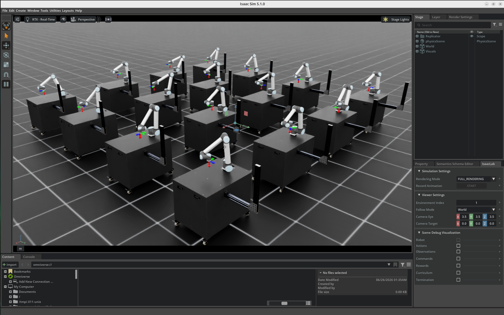
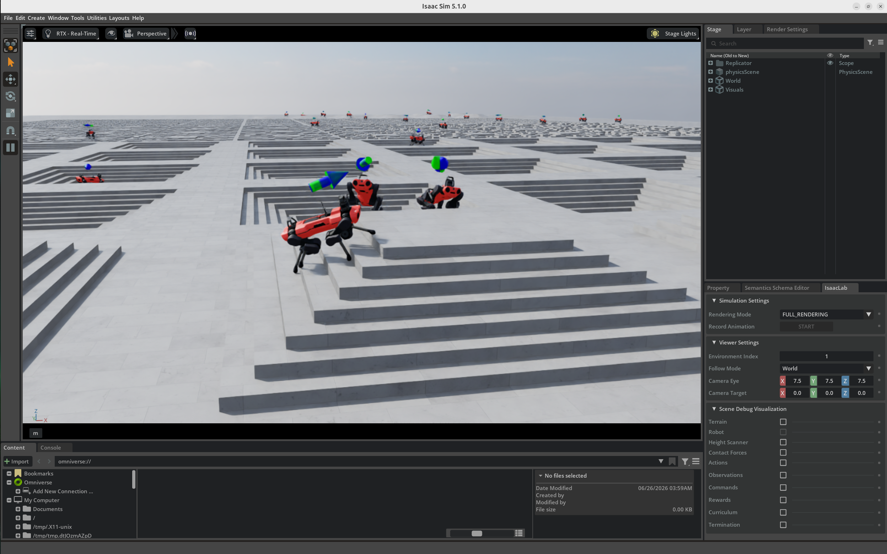

# Deep Reinforcement Learning for Robotics using NVIDIA Isaac Lab

> End-to-end reinforcement learning for robotic manipulation, quadruped locomotion, and humanoid control using NVIDIA Isaac Lab and Proximal Policy Optimization (PPO).

---

📹 `videos/h1.mp4`

---

## Project Overview

This repository demonstrates the complete workflow of developing reinforcement learning policies for robots using **NVIDIA Isaac Lab**.

Instead of focusing on a single robot, this project explores three different robotic platforms that require fundamentally different control strategies:

- Industrial Manipulator (UR10)
- Quadruped Robot (ANYmal C)
- Humanoid Robot (H1)

> Each policy was trained using **Proximal Policy Optimization (PPO)** in **NVIDIA Isaac Lab**, leveraging massively parallel GPU-accelerated simulation to efficiently learn robot control policies.

The project covers:

- Reinforcement Learning for Robotics
- Robot Manipulation
- Quadruped Locomotion
- Humanoid Locomotion
- Isaac Sim
- NVIDIA Isaac Lab
- PPO
- Domain Randomization
- Parallel Simulation
- Policy Evaluation

> Across the three training experiments, more than 540 million simulation steps were executed to learn policies for robotic manipulation, quadruped locomotion, and humanoid control.

---

## Learning Pipeline

```text
Isaac Sim
      │
      ▼
Isaac Lab Environment
      │
      ▼
Reward Function + Observations
      │
      ▼
PPO Training
      │
      ▼
PyTorch Policy
      │
      ▼
Policy Evaluation
```

---

# Trained Robots

| Robot    | Task                     | Learning Objective                         |
| -------- | ------------------------ | ------------------------------------------ |
| UR10     | End-effector Reaching    | Manipulation and target tracking           |
| ANYmal C | Rough Terrain Locomotion | Quadruped locomotion over uneven terrain   |
| H1       | Velocity Control         | Humanoid locomotion and whole-body control |

---

# UR10 Reaching



### Objective

Train a UR10 robotic manipulator to move its end-effector towards randomly generated target positions.

### Environment

- Isaac Lab Reach Environment
- Continuous Control
- PPO
- Parallel Simulation

### Training

| Property      | Value      |
| ------------- | ---------- |
| Iterations    | 1000       |
| Total Steps   | 98,304,000 |
| Training Time | ~7 Minutes |

### Training Results

| Metric            | Value      |
| ----------------- | ---------- |
| Mean Reward       | 0.40       |
| Position Error    | 0.0177 m   |
| Orientation Error | 0.0986 rad |

---

# ANYmal C Rough Terrain



### Objective

Train a quadruped robot to traverse procedurally generated rough terrain while tracking commanded velocities.

### Environment

- Isaac Lab Rough Terrain
- Curriculum Learning
- PPO
- Terrain Randomization

### Training

| Property      | Value       |
| ------------- | ----------- |
| Iterations    | 1500        |
| Total Steps   | 147,456,000 |
| Training Time | ~2 Hours    |

### Training Results

| Metric               | Value  |
| -------------------- | ------ |
| Mean Reward          | 16.29  |
| Velocity Error (XY)  | 0.3393 |
| Velocity Error (Yaw) | 0.2863 |

---

# H1 Humanoid


### Objective

Train a humanoid robot to perform commanded velocity tracking over procedurally generated rough terrain.

### Environment

- Isaac Lab Humanoid
- PPO
- Curriculum Learning
- Rough Terrain

### Training

| Property      | Value       |
| ------------- | ----------- |
| Iterations    | 3000        |
| Total Steps   | 294,912,000 |
| Training Time | ~70 Minutes |

### Training Results

| Metric               | Value  |
| -------------------- | ------ |
| Mean Reward          | 27.35  |
| Velocity Error (XY)  | 0.2353 |
| Velocity Error (Yaw) | 0.4795 |

---

# Project Structure

```
robotics-deep-reinforcement-learning/
│
├── README.md
├── LICENSE
├── .gitignore
│
└── docs/
    ├── images/
    ├── videos/
    ├── reinforcement-learning.md
    ├── isaac-lab.md
    ├── ur10-reaching.md
    ├── anymal-locomotion.md
    └── h1-humanoid.md
```

---

# Technologies Used

- NVIDIA Isaac Lab
- NVIDIA Isaac Sim
- PyTorch
- Reinforcement Learning
- PPO (Proximal Policy Optimization)
- Python
- NVIDIA CUDA
- GPU-Accelerated Physics Simulation

---

# Repository Documentation

Detailed explanations are provided in the `docs/` directory.

| Document                  | Description                            |
| ------------------------- | -------------------------------------- |
| reinforcement-learning.md | Fundamentals of Reinforcement Learning |
| isaac-lab.md              | Isaac Lab Architecture and Workflow    |
| ur10-reaching.md          | UR10 Reaching Task                     |
| anymal-locomotion.md      | ANYmal Locomotion                      |
| h1-humanoid.md            | H1 Velocity Control                    |

---

# Model Downloads

The trained PPO policies are available as a separate downloadable model package on Kaggle.

**Kaggle Model**

https://www.kaggle.com/models/jaisalkjain/isaac-lab-ppo-trained-policies-for-robotics

The package includes the final trained policies for:

- UR10 Reaching (`model_999.pt`)
- ANYmal C Rough Terrain (`model_1499.pt`)
- H1 Humanoid Rough Terrain (`model_2999.pt`)

Each model also includes the corresponding training configuration (`agent.yaml` and `env.yaml`) used during training.

---

# Roadmap

Potential extensions to this project include:

- Sim-to-real policy transfer for physical robots.
- Vision-based reinforcement learning using RGB-D observations.
- Comparative evaluation of PPO, SAC, and TD3 on identical robotics tasks.
- Multi-agent reinforcement learning environments.
- Integration of trained policies with ROS 2 for deployment on real robotic platforms.

---
