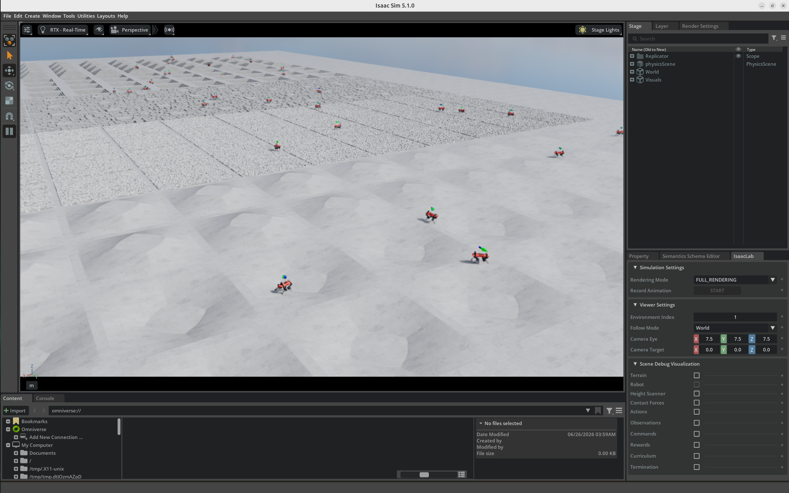
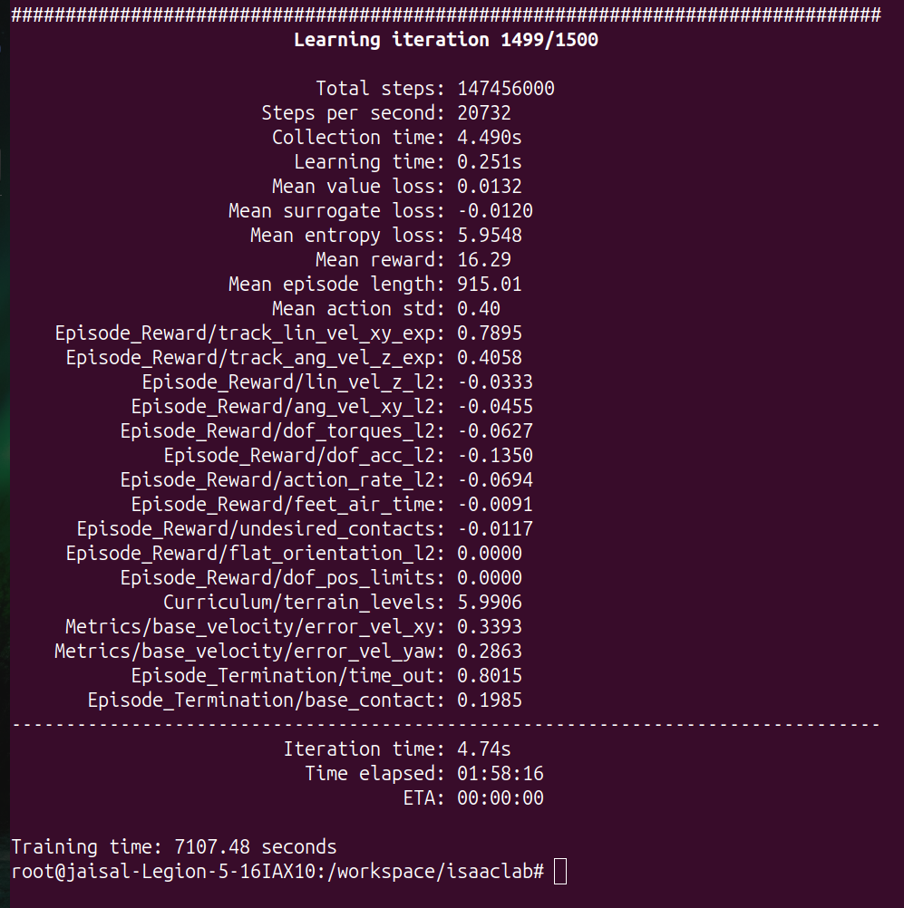

# ANYmal C Rough Terrain Locomotion using Reinforcement Learning

📹 `../videos/anymal.mp4`

---

## Introduction

This project demonstrates training a quadruped robot to perform autonomous locomotion over procedurally generated rough terrain using **Proximal Policy Optimization (PPO)** in **NVIDIA Isaac Lab**.

Unlike traditional robotics approaches that rely on manually designed gaits or model-based controllers, the robot learns stable locomotion entirely through reinforcement learning by interacting with millions of simulated environments.

The resulting policy enables the robot to track commanded linear and angular velocities while maintaining balance across uneven terrain.

---

# Task Overview

The objective of this task is to train the quadruped robot to:

- Walk over procedurally generated rough terrain
- Maintain balance while moving
- Track commanded linear and angular velocities
- Adapt to changing terrain profiles
- Produce smooth and energy-efficient locomotion

Rather than memorizing a single environment, the robot experiences continuously changing terrain throughout training, allowing the learned policy to generalize to a wide range of walking conditions.

---

# Robot Description

The **ANYmal C** is a torque-controlled quadruped robot designed for autonomous locomotion in challenging environments.

Its four-legged configuration enables stable traversal across terrain that would be difficult or impossible for wheeled robots.

Typical applications include:

- Industrial inspection
- Mining
- Construction sites
- Search and rescue
- Autonomous exploration

---

# Environment

Environment:

```text
Isaac-Velocity-Rough-Anymal-C-v0
```

Training framework:

- NVIDIA Isaac Lab
- NVIDIA Isaac Sim
- PPO (RSL-RL)
- GPU-accelerated simulation

Training mode:

```text
Headless
```

Running the simulation without rendering allows more GPU resources to be dedicated to physics simulation and reinforcement learning.

---

# Observation Space

The policy receives observations describing both the robot state and its interaction with the environment.

Typical observations include:

- Base linear velocity
- Base angular velocity
- Joint positions
- Joint velocities
- Gravity projection
- Previous actions
- Commanded velocities

These observations allow the policy to continuously adapt its gait while traversing uneven terrain.

---

# Action Space

The neural network outputs continuous joint position commands for all four legs.

During every simulation step, the following process is executed:

```text
Observations

↓

Policy Network

↓

Joint Position Commands

↓

Quadruped Motion
```

The policy gradually discovers coordinated leg movements that maximize stability and velocity tracking.

---

# Reward Function

The reward function encourages stable locomotion while discouraging inefficient behavior.

Positive reward terms include:

- Accurate velocity tracking
- Maintaining balance
- Smooth forward motion
- Stable body orientation

Penalty terms include:

- Excessive joint velocity
- Large action changes
- Unstable motion
- High energy consumption

Curriculum learning progressively increases terrain difficulty as the robot becomes more capable.

---

# Training Configuration

| Property               |                            Value |
| ---------------------- | -------------------------------: |
| Algorithm              |                              PPO |
| Environment            | Isaac-Velocity-Rough-Anymal-C-v0 |
| Iterations             |                             1500 |
| Total Simulation Steps |                      147,456,000 |
| Training Time          |                         ~2 Hours |
| Simulation Mode        |                         Headless |

Training command:

```bash
./isaaclab.sh -p scripts/reinforcement_learning/rsl_rl/train.py \
--task Isaac-Velocity-Rough-Anymal-C-v0 \
--headless
```

---

# Training Results

| Metric                 | Final Value |
| ---------------------- | ----------: |
| Mean Reward            |       16.29 |
| Linear Velocity Error  |      0.3393 |
| Angular Velocity Error |      0.2863 |
| Mean Episode Length    |        1000 |

The final policy successfully learned stable quadruped locomotion while accurately tracking commanded velocities over procedurally generated rough terrain.

---

# Policy Evaluation

After training, the learned policy was evaluated using Isaac Lab's playback script.

```bash
./isaaclab.sh -p scripts/reinforcement_learning/rsl_rl/play.py \
--task Isaac-Velocity-Rough-Anymal-C-v0 \
--use_pretrained_checkpoint
```

During evaluation, the robot continuously traverses randomly generated terrain while responding to changing velocity commands in real time.

---

# Results

## Environment Overview



---

## Robot Close-up


---

## Training Progress



The training process completed after **1500 iterations**, automatically generating PyTorch checkpoints, TensorBoard logs, and experiment configuration files for later evaluation.

---

# Challenges Encountered

Several practical observations were made during development:

- Rough terrain locomotion required substantially longer training than the UR10 reaching task.
- Curriculum learning gradually increased terrain complexity, improving policy stability throughout training.
- More than **147 million** simulation steps were executed using massively parallel GPU simulation.
- Training checkpoints and experiment logs were exported from the Docker container to the host machine for long-term storage and documentation.

---

# Key Takeaways

- Successfully trained a quadruped robot for autonomous locomotion over procedurally generated rough terrain.
- Learned stable gait generation through reinforcement learning without manually programming walking patterns.
- Executed approximately **147 million** simulation steps using GPU-accelerated parallel simulation.
- Demonstrated curriculum learning, procedural terrain generation, and velocity tracking in NVIDIA Isaac Lab.
- Generated reusable PyTorch policy checkpoints for evaluation and future deployment.
