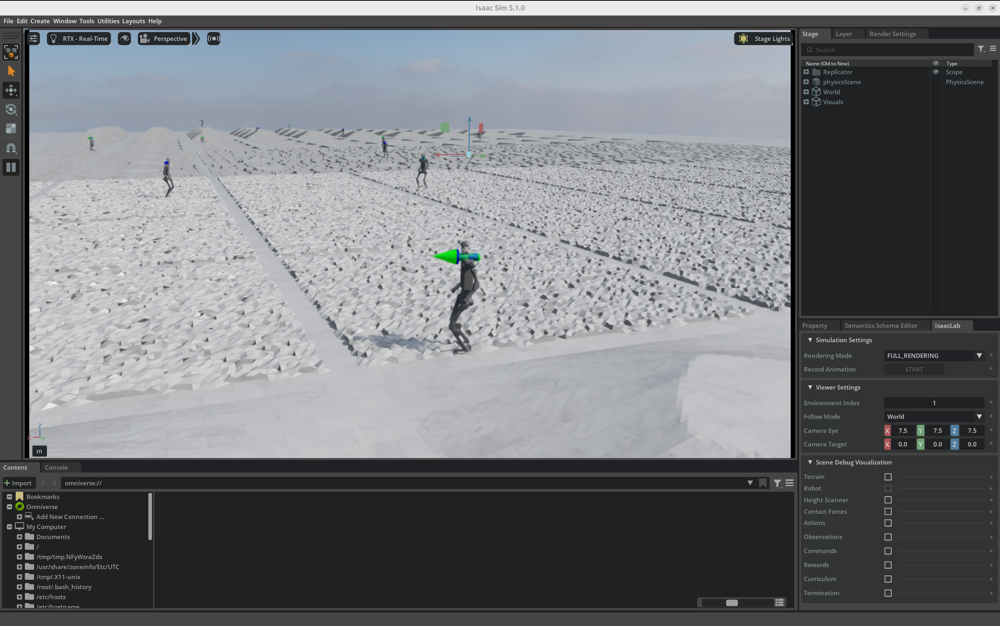
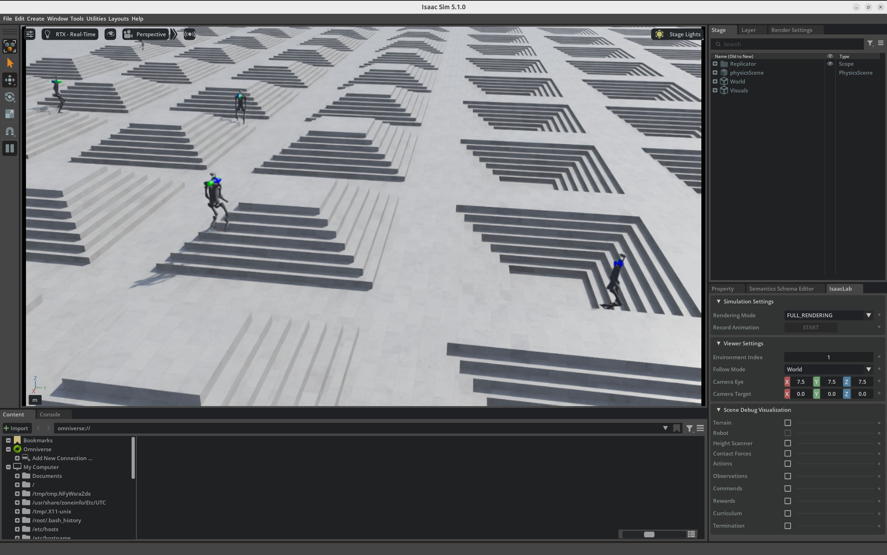
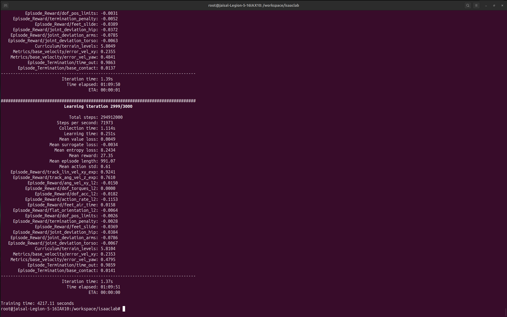

# H1 Humanoid Velocity Control using Reinforcement Learning

📹 `../videos/h1.mp4`

---

## Introduction

This project demonstrates training a humanoid robot to perform commanded velocity tracking over procedurally generated rough terrain using **Proximal Policy Optimization (PPO)** in **NVIDIA Isaac Lab**.

Humanoid locomotion is one of the most challenging problems in robotics due to the robot's high number of degrees of freedom, inherently unstable dynamics, and the need to coordinate the entire body while maintaining balance.

Rather than programming walking behaviors manually, the humanoid learns stable locomotion entirely through reinforcement learning by interacting with hundreds of millions of simulated environments.

---

# Task Overview

The objective of this task is to train the humanoid robot to:

- Walk while maintaining balance
- Track commanded linear and angular velocities
- Traverse procedurally generated rough terrain
- Produce stable whole-body locomotion
- Adapt to changing terrain conditions

The environment continuously changes throughout training, requiring the policy to generalize rather than memorize a single walking strategy.

---

# Robot Description

The **H1** is a full-sized humanoid robot designed for research in bipedal locomotion and whole-body control.

Unlike quadruped robots, humanoids must maintain dynamic balance using only two legs, making locomotion significantly more complex.

Potential applications include:

- Human-centered environments
- Warehouse automation
- Industrial assistance
- Service robotics
- Humanoid research

---

# Environment

Environment:

```text
Isaac-Velocity-Rough-H1-v0
```

Training framework:

- NVIDIA Isaac Lab
- NVIDIA Isaac Sim
- PPO (RSL-RL)
- GPU-accelerated simulation

Training mode:

```text
Headless
```

Headless execution allows the GPU to prioritize physics simulation and reinforcement learning instead of rendering graphics, making long training sessions significantly more efficient.

---

# Observation Space

The policy receives observations describing both the robot state and its interaction with the environment.

Typical observations include:

- Base linear velocity
- Base angular velocity
- Joint positions
- Joint velocities
- Body orientation
- Gravity projection
- Previous actions
- Commanded velocities

These observations provide sufficient information for the policy to generate coordinated whole-body movements while maintaining balance.

---

# Action Space

The neural network predicts continuous joint position commands for the humanoid's actuated joints.

Each simulation step follows the pipeline:

```text
Observations

↓

Policy Network

↓

Joint Position Commands

↓

Whole-Body Motion
```

The policy learns coordinated arm, torso, hip, knee, and ankle movements that produce stable bipedal locomotion.

---

# Reward Function

The reward function encourages efficient and stable humanoid locomotion.

Positive reward terms include:

- Velocity tracking
- Stable walking
- Upright posture
- Smooth locomotion

Penalty terms include:

- Excessive joint motion
- Large action changes
- Falling
- High energy consumption

Curriculum learning progressively increases terrain difficulty throughout training, allowing the policy to develop increasingly robust locomotion strategies.

---

# Training Configuration

| Property               |                      Value |
| ---------------------- | -------------------------: |
| Algorithm              |                        PPO |
| Environment            | Isaac-Velocity-Rough-H1-v0 |
| Iterations             |                       3000 |
| Total Simulation Steps |                294,912,000 |
| Training Time          |                ~70 Minutes |
| Simulation Mode        |                   Headless |

Training command:

```bash
./isaaclab.sh -p scripts/reinforcement_learning/rsl_rl/train.py \
--task Isaac-Velocity-Rough-H1-v0 \
--headless
```

---

# Training Results

| Metric                 | Final Value |
| ---------------------- | ----------: |
| Mean Reward            |       27.35 |
| Linear Velocity Error  |      0.2353 |
| Angular Velocity Error |      0.4795 |
| Mean Episode Length    |        1000 |

The trained policy successfully learned stable humanoid locomotion while accurately tracking commanded velocities over procedurally generated rough terrain.

---

# Policy Evaluation

After training, the learned policy was evaluated using Isaac Lab's playback script.

```bash
./isaaclab.sh -p scripts/reinforcement_learning/rsl_rl/play.py \
--task Isaac-Velocity-Rough-H1-v0 \
--use_pretrained_checkpoint
```

During evaluation, the humanoid continuously walks over randomly generated terrain while adapting its gait to changing velocity commands.

---

# Results

## Environment Overview



---

## Robot Close-up



---

## Training Progress



The training process completed after **3000 iterations**, automatically generating PyTorch checkpoints, TensorBoard logs, and experiment configuration files for later evaluation.

---

# Challenges Encountered

Several practical observations were made during development:

- Humanoid locomotion required the largest training workload among all experiments in this repository.
- Stable bipedal locomotion is considerably more difficult than quadruped locomotion due to the reduced support base and higher balance requirements.
- Nearly **295 million** simulation steps were executed using massively parallel GPU simulation.
- Long-duration training was performed in headless mode, with checkpoints periodically saved and later exported from the Docker container for preservation.

---

# Key Takeaways

- Successfully trained a humanoid robot for stable velocity-controlled locomotion over procedurally generated rough terrain.
- Learned whole-body coordination entirely through reinforcement learning without manually designing walking controllers.
- Executed approximately **295 million** simulation steps using GPU-accelerated parallel simulation.
- Demonstrated large-scale reinforcement learning for high-degree-of-freedom humanoid control in NVIDIA Isaac Lab.
- Generated reusable PyTorch policy checkpoints for evaluation and future deployment.
