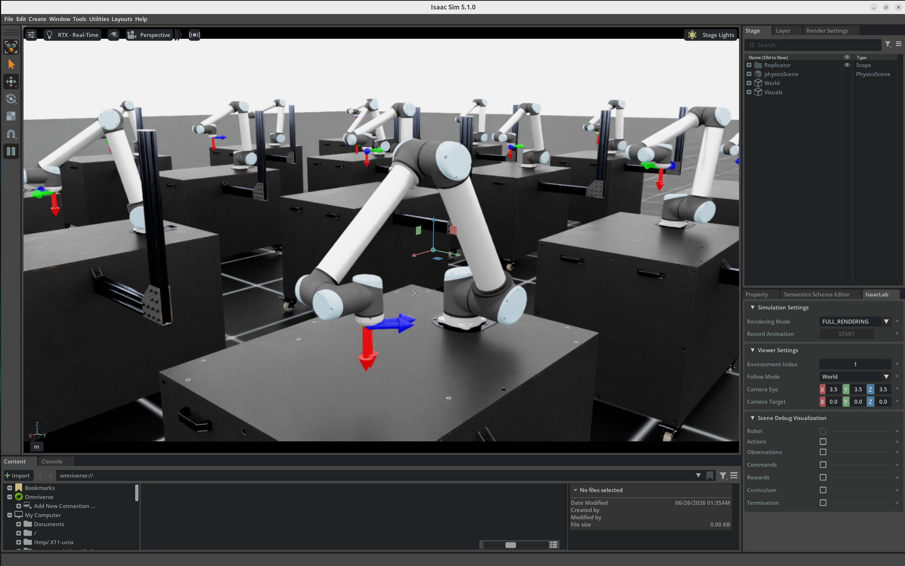
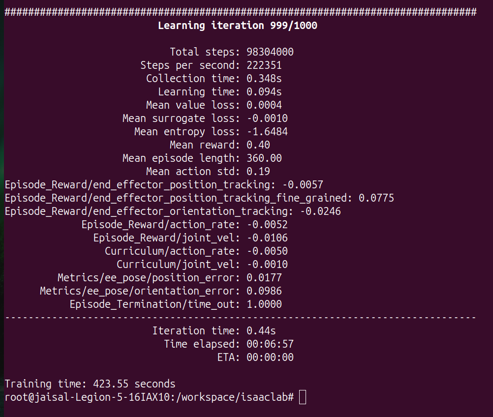

# UR10 End-Effector Reaching using Reinforcement Learning

📹 `../videos/ur10.mp4`

---

## Introduction

This project demonstrates training an industrial robotic manipulator using **Proximal Policy Optimization (PPO)** in **NVIDIA Isaac Lab**.

The objective is to learn a control policy that moves the UR10 robot's end-effector towards randomly generated target positions entirely through reinforcement learning. Rather than programming the robot with inverse kinematics or trajectory planning, the policy discovers the required joint movements by maximizing a reward function over millions of simulation steps.

---

# Task Overview

The UR10 reaching task is a continuous control problem.

At the beginning of each episode, a random target position is generated within the robot's workspace.

The reinforcement learning policy receives observations describing the current robot state and predicts continuous joint actions. As training progresses, the robot gradually learns how to move its end-effector accurately toward the target.

Once the target is reached or the episode terminates, the environment resets and a new target is generated.

---

# Robot Description

The **UR10** is a six-degree-of-freedom industrial robotic manipulator developed for manipulation and pick-and-place applications.

In this project, the robot is trained to perform accurate end-effector positioning inside a simulated Isaac Lab environment.

Applications of similar reaching tasks include:

- Pick-and-place
- Object manipulation
- Assembly
- Machine tending
- Warehouse automation

---

# Environment

Environment:

```
Isaac-Reach-UR10-v0
```

Training framework:

- NVIDIA Isaac Lab
- NVIDIA Isaac Sim
- PPO (RSL-RL)
- GPU-accelerated simulation

Training mode:

```
Headless
```

Running without rendering allows more GPU resources to be dedicated to simulation and reinforcement learning.

---

# Observation Space

The policy receives observations describing the robot state.

Typical observations include:

- Joint positions
- Joint velocities
- End-effector position
- Goal position
- Relative position between end-effector and target

These observations become the input to the policy network.

---

# Action Space

The neural network predicts continuous actions corresponding to robot joint commands.

During every simulation step:

```
Observation

↓

Policy Network

↓

Joint Actions

↓

Robot Motion
```

The policy continuously updates the joint commands until the end-effector reaches the desired target.

---

# Reward Function

The reward function encourages accurate reaching behavior while penalizing unnecessary motion.

Typical reward components include:

Positive rewards

- Moving closer to the target
- Accurate end-effector positioning

Penalty terms

- Large joint velocities
- Excessive action changes
- Poor tracking accuracy

The robot is never explicitly told how to move. Instead, it discovers useful behaviors by maximizing the cumulative reward.

---

# Training Configuration

| Property               |               Value |
| ---------------------- | ------------------: |
| Algorithm              |                 PPO |
| Environment            | Isaac-Reach-UR10-v0 |
| Iterations             |                1000 |
| Total Simulation Steps |          98,304,000 |
| Training Time          |          ~7 Minutes |
| Simulation Mode        |            Headless |

Training command:

```bash
./isaaclab.sh -p scripts/reinforcement_learning/rsl_rl/train.py \
--task Isaac-Reach-UR10-v0 \
--headless
```

---

# Training Results

| Metric              | Final Value |
| ------------------- | ----------: |
| Mean Reward         |        0.40 |
| Position Error      |    0.0177 m |
| Orientation Error   |  0.0986 rad |
| Mean Episode Length |         360 |

The final policy consistently reaches randomly generated targets with low position error while maintaining stable motion throughout the episode.

---

# Policy Evaluation

After training, the learned policy was evaluated using the Isaac Lab playback script.

```bash
./isaaclab.sh -p scripts/reinforcement_learning/rsl_rl/play.py \
--task Isaac-Reach-UR10-v0 \
--use_pretrained_checkpoint
```

During evaluation, the robot repeatedly tracks randomly generated goal positions using the trained neural network policy.

---

# Results

## Environment Overview


## Robot Close-up



---

## Training Progress



The training process completed successfully after 1000 iterations, producing a series of checkpoint files and TensorBoard logs for evaluation.

---

# Challenges Encountered

During development, several practical considerations were observed:

- Headless execution provided a more stable training workflow than rendering the simulation continuously.
- Training checkpoints were generated automatically inside the Docker container and later copied to the host system for long-term storage.
- Isaac Lab automatically organized experiment logs, TensorBoard events, configuration files, and policy checkpoints for each training run.
- The complete training process required nearly one hundred million simulation steps despite taking only a few minutes due to GPU-accelerated parallel simulation.

---

# Key Takeaways

- Successfully trained an industrial robotic manipulator using reinforcement learning.
- Learned continuous end-effector control without explicitly programming robot trajectories.
- Executed approximately **98 million** simulation steps using parallel GPU simulation.
- Generated reusable PyTorch policy checkpoints for deployment and evaluation.
- Demonstrated the complete reinforcement learning workflow from training to policy evaluation using NVIDIA Isaac Lab.
